REC UT\_03 

instalar la aplicación power automate hacer un pequeño proyecto subir ese proyecto al directorio de github con las imágenes en una carpeta aparte y crear en código markdown la misma presentación y subirlo a github también. 

1. Explicación de la aplicación. 

Power Automate es una herramienta de Microsoft que permite automatizar tareas repetitivas sin necesidad de programar. Conecta aplicaciones como Outlook, Excel, Teams, OneDrive, entre muchas otras, para que puedas crear flujos de trabajo que envíen correos, muevan archivos, registren datos o te notifiquen automáticamente, ahorrando tiempo y evitando errores. También puedes usarlo en tu PC con Power Automate Desktop para automatizar acciones locales como abrir programas o mover archivos. 

2. instalar la aplicación. 

Usando el siguiente enlace accedemos a la pagina de descargar: [enlace](https://make.powerautomate.com/environments/9e8bfa6d-5cbf-e202-9f18-63b91643c148/create)

ya en la página damos arriba derecha instalar para descargar el exe e instalar la aplicación: 

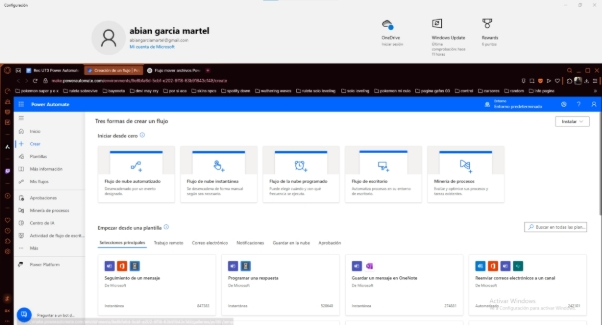

damos en el installer y seguimos el asistente: 

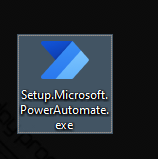

damos en siguiente hasta completar el asistente:  

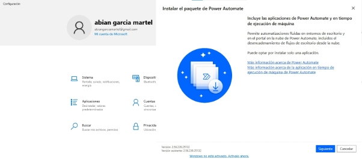

aceptamos términos: 

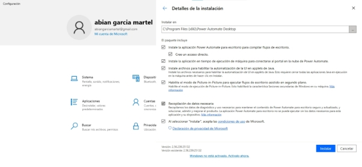

instalada le damos a iniciar aplicación: 

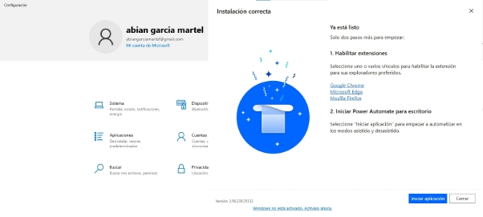

3. Explicación del proyecto. 

El proyecto que he decidido desarrollar consiste en un flujo sencillo pero funcional, cuyo objetivo principal es fusionar archivos PDF de manera rápida y automática mediante Power Automate Desktop. 

Al ejecutar el flujo, el usuario es guiado a través de una interfaz amigable que le solicita seleccionar dos archivos PDF mediante un explorador de archivos. Una vez seleccionados, se le pide que indique la carpeta de destino donde desea guardar el archivo resultante. El sistema genera un nuevo documento PDF que contiene ambos archivos combinados uno debajo del otro, respetando el orden en que fueron seleccionados y muestra un mensaje de confirmación al finalizar el proceso. 

Este flujo puede resultar especialmente útil para tareas administrativas, compilación de informes, entrega de documentación o incluso para resolver imprevistos de última hora en los que se necesiten unificar varios documentos de forma rápida y sin depender de programas externos. 

Aunque se trata de una solución sencilla, demuestra cómo una pequeña automatización puede ahorrar tiempo y mejorar la eficiencia en procesos cotidianos. 

4. realización del proyecto. 

lo primero es crear el flujo y ponerle nombre: 

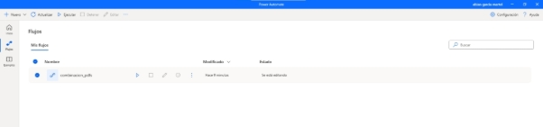

asi se veria el flujo vacío: 

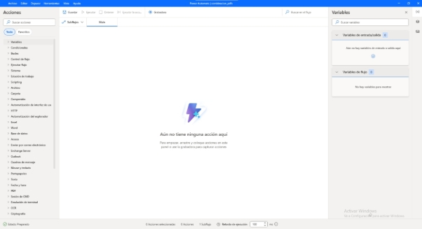

empezando con el flujo vamos a la barra de la izquierda buscamos control de flujo> comentario para añadir comentarios que solo se verán en el flujo para ayudar al entendimiento del mismo: 

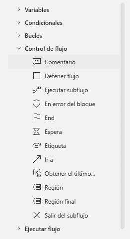

lo colocamos y escribimos la utilidad que tendrá el script: 

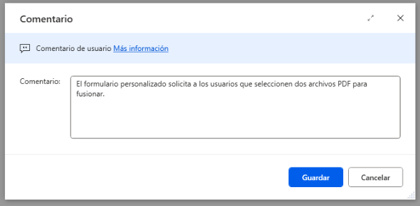

volvemos a la parte izquierda y buscamos cuadros de mensaje > mostrar formulario personalizado: 

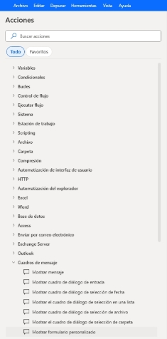

aquí nos dice las variables que se crean por defecto y la diseño del formulario: 

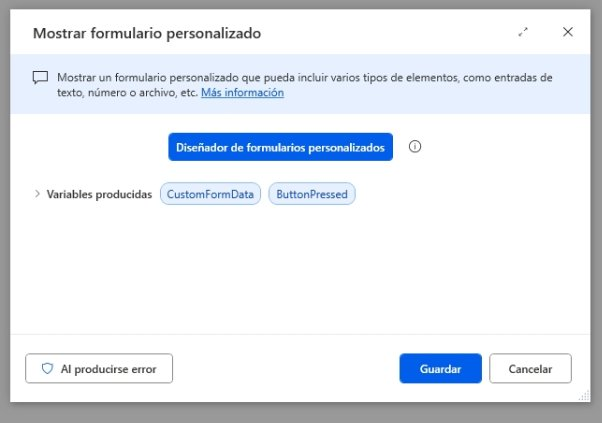

al dar en diseñar nos sale lo siguiente: 

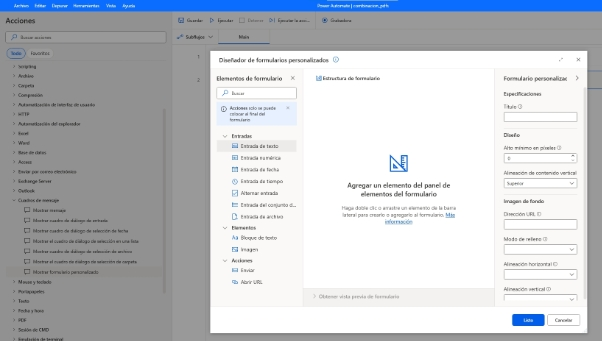

añadimos un bloque de texto lo llamamos título y le ponemos lo que queramos que contenga:  

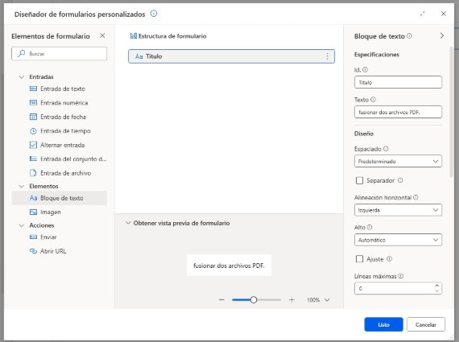

ahora a la derecha tenemos el estilo del texto lo decoramos un poco y vemos que la vista previa también cambio: 

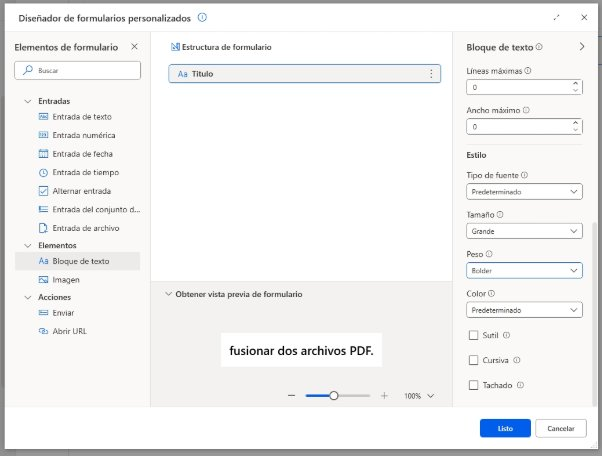

creo otro bloque de texto en el cual pido el primer pdf: 

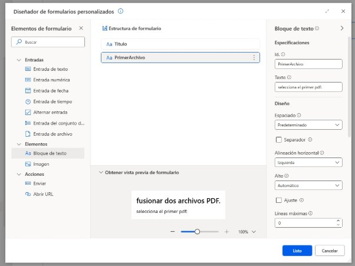

ahora creo una inserción de archivo le pongo el id lo pongo en obligatorio y un mensaje de error: 

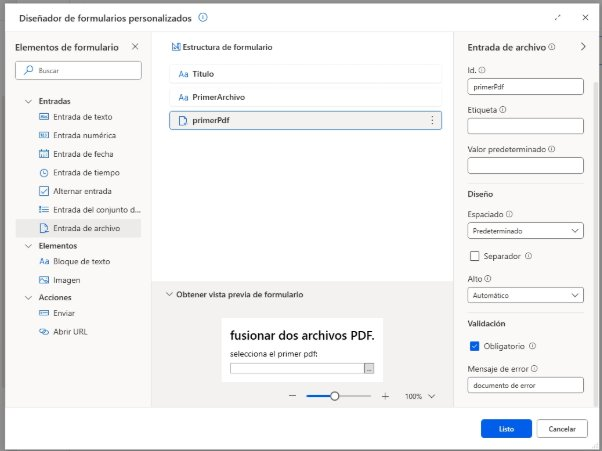

hago lo mismo para el segundo archivo: 

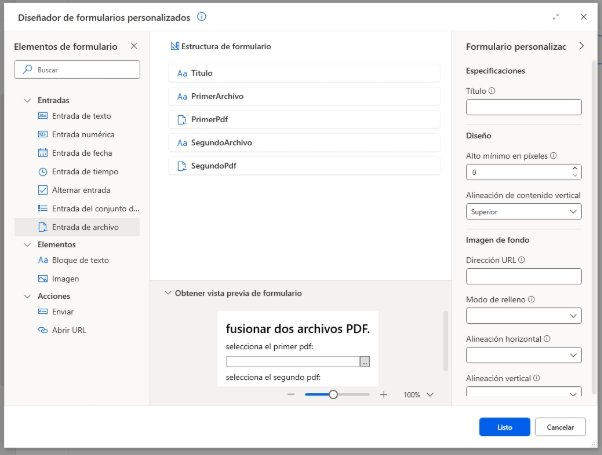

por último creo un boton de submit para poder enviar la orden del formulario: 

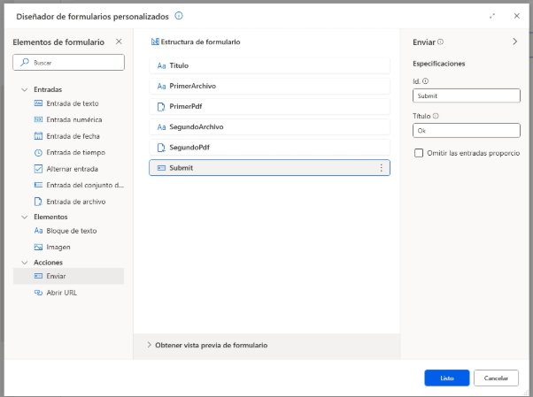

ya con el formulario creado creo un comentario para explicar el siguiente paso: 

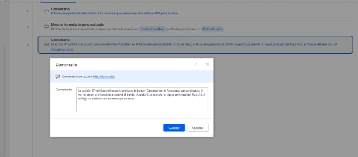ahora a la izquierda busco condicionales > if lo creo y le pongo en primer operador la variable que se generó en el formulario %ButtonPressed% (los % son para que el flujo tome el entendimiento de que lo que hay en medio es una variable): 

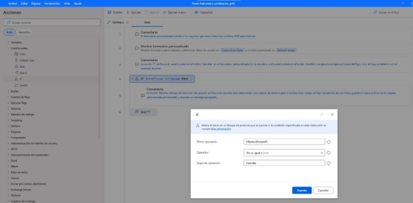

creo otro comentario: 

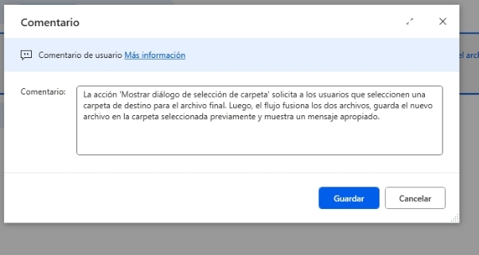

creó un cuadro de diálogo de selección de carpeta esto nos abrira una ventanita para seleccionar donde dejar el archivo fusionado (observar que se genera una variable llamada destinationfolder): 

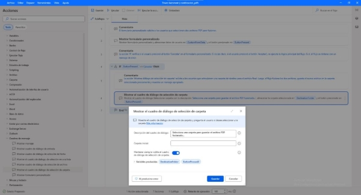

ahora en la izquierda de nuevo busco PDF > combinar archivos PDF creo una funcion llamada combinar archivos PDF seleccionó la variable del formulario y al lado entre corchetes el id de la selección de archivos que pusimos antes luego en la ruta del combinado ponemos la variable que 

se generó antes por defecto con el cuadro de diálogo de selección de carpeta y luego un nombre predeterminado como ArchivoFusionado.pdf: 

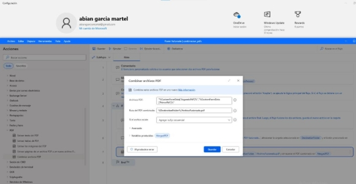

ahora por último voy a la izquierda cuadros de mensaje > mostrar mensaje y le pongo el siguiente mensaje para indicar que se creó el archivo: 

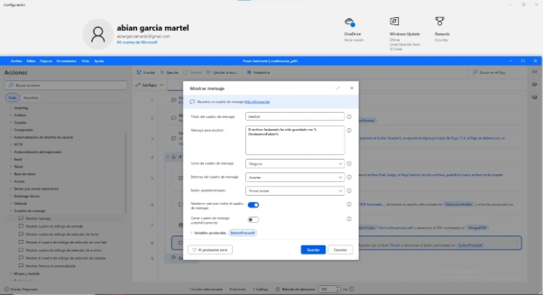

le doy a guardar y luego a ejecutar: 

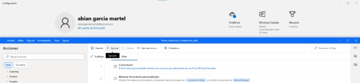

nos sale el formulario: 

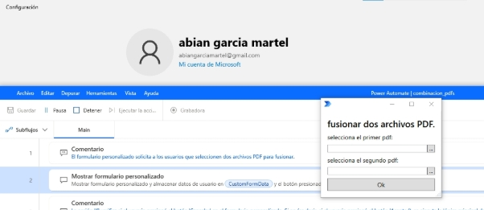

doy en el botón y seleccionó el archivo: 

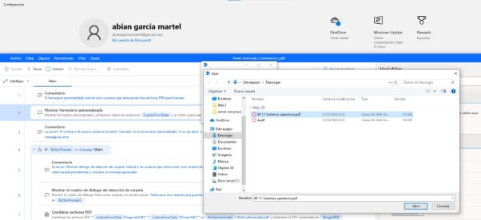

hago lo mismo con el otro y ahora con dos seleccionados le doy a OK: 

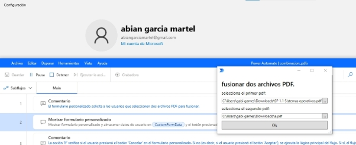

ahora selecciono la carpeta donde voy a dejar el archivo fusionado: 

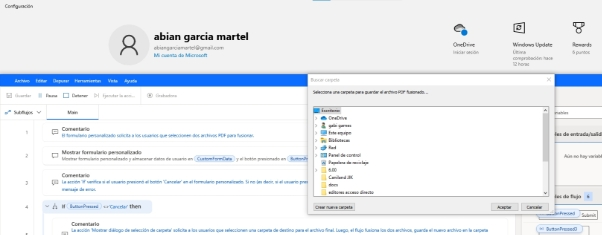

y nos sale el siguiente mensaje: 

por último voy al escritorio y veo que tengo el archivofusionado: 

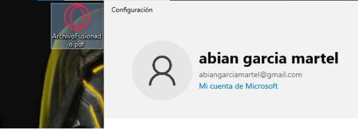

lo abro para comprobar: 

ambos archivos uno frente al otro: 

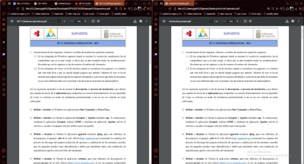

segundo archivo comprobación: 

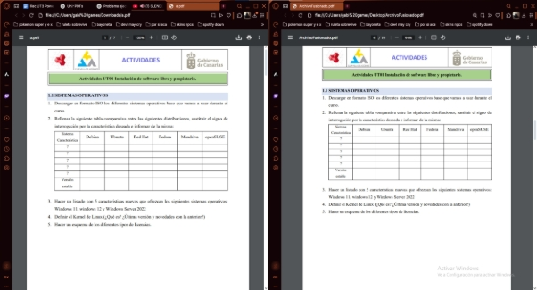

5. subirlo a github. 
5. Creación del código en markdown. 
5. Comprobación del código. 
